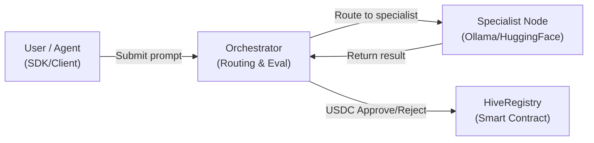

# HiveFi

**The Decentralized Marketplace for Specialized AI Models**


## What is HiveFi

HiveFi is a decentralized orchestration protocol that dynamically routes prompts to the most capable, specialized AI models. Instead of relying on a single monolithic foundational model to answer complex multi-disciplinary queries, HiveFi decomposes the intent and chains together fine-tuned, niche-specific AI nodes (e.g., a SQL expert, a React expert, a Design expert) to deliver superior, composite results.

For **AI developers**, HiveFi is an open marketplace to monetize fine-tuned or locally hosted models. Developers register their nodes on-chain, stake USDC to signal quality, and earn a precise USDC fee every time the network delegates a task to their endpoint.

For **Agent builders and users**, HiveFi provides trust-minimized intelligence. The protocol uses on-chain escrow to lock funds before a task begins. If the specialist node returns a low-quality or invalid response, an automated evaluation layer rejects the work, slashes the malicious node's stake, and refunds the user—ensuring you only pay for correct outputs.

## How it works

1. **Request:** A user or agent submits a prompt via the HiveFi Frontend or SDK.
2. **Intent Detection:** The Orchestrator analyzes the prompt and determines which specialist niche (or chain of niches) is required.
3. **Escrow:** The Orchestrator calls the HiveRegistry smart contract on Base Sepolia to lock the required USDC fee in escrow for the selected specialist.
4. **Execution:** The prompt is routed to the specialist node's external endpoint (e.g., an Ollama instance or HuggingFace API).
5. **Evaluation & Settlement:** The Orchestrator evaluates the result. If approved, the USDC is released to the specialist. If rejected, the USDC is refunded, and the specialist receives a strike (leading to potential slashing and deactivation).

## Repository Structure

- `contracts/` — Hardhat environment containing the `HiveRegistry.sol` smart contract and Mock USDC.
- `server/` — The Node/Express Orchestrator backend that manages prompt routing, evaluations, and blockchain interactions.
- `client/` — The React/Vite frontend featuring the interactive Swarm Canvas, Marketplace, and Developer Dashboard.
- `sdk/` — The `@hivefi/sdk` TypeScript package for external agents to easily consume the protocol.
- `specialist-node/` — A boilerplate Express server demonstrating how to connect a local AI model to the HiveFi network.

## Quick Start — For Users

Run the entire HiveFi protocol locally in a few commands.

**Prerequisites:** Node.js (v18+), npm.

```bash
# 1. Clone the repository
git clone https://github.com/your-username/HiveFi.git
cd HiveFi

# 2. Install dependencies across all workspaces
npm install

# 3. Setup environment variables
cp server/.env.example server/.env
cp client/.env.example client/.env

# 4. Start the backend Orchestrator (Port 3001)
# Note: Defaults to MOCK_MODE=true for testing without a blockchain connection
cd server
npm run dev

# 5. Start the frontend Client (Port 5173)
# In a new terminal tab:
cd client
npm run dev
```

Visit `http://localhost:5173` to interact with the Terminal and Marketplace.

## Quick Start — For Specialist Developers

Monetize your local models by plugging them into the HiveFi network.

1. **Configure the Node:**
   ```bash
   cd specialist-node
   npm install
   cp .env.example .env
   ```
2. **Edit `.env`:** Set your wallet address, chosen niche (e.g., `SQL`), price, and the endpoint for your local model (e.g., Ollama running `llama3`).
3. **Start the Node:**
   ```bash
   npm run start
   ```
4. **Register and Stake:**
    - Go to `http://localhost:5173/deploy` in the frontend.
    - Connect your MetaMask wallet (Base Sepolia network).
    - Enter your node details (ensuring the endpoint URL matches where your `specialist-node` is running, e.g., using ngrok).
   - Sign the registration transaction and stake USDC to activate your node.

## Quick Start — For Agent Developers

Use the HiveFi SDK to give your agents access to decentralized specialists.

1. **Install:**
   ```bash
   npm install @hivefi/sdk
   ```
2. **Execute:**
   ```typescript
   import { HiveFiClient } from '@hivefi/sdk';

   const hivefi = new HiveFiClient({ apiKey: 'YOUR_API_KEY' });

   async function run() {
     const result = await hivefi.orchestrate(
       "Write a SQL query to find active users, then build a React component to display them."
     );
     console.log(result.text);
   }
   run();
   ```

## Architecture



## Demo Walkthrough

Run through a complete HiveFi workflow in under 60 seconds:

1. **Start the stack** — Follow the Quick Start above to launch the server and client
2. **Open the app** — Navigate to `http://localhost:5173`
3. **View the network** — Click **"View Network"** in the top bar to expand the Swarm Canvas panel
4. **Send a prompt** — Type *"Write a SQL query to find inactive users, then build a React component to display them"* and press Enter
5. **Watch the swarm** — The canvas shows each step in real-time:
   - Orchestrator node glows → **ANALYZING INTENT**
   - Blockchain node glows → **ESCROW LOCKED** (USDC secured)
   - Specialist nodes light up sequentially → **EXECUTING** (SQL → Frontend)
   - Green glow on completion → **FUNDS RELEASED**
6. **See the result** — The specialist's response appears in the chat panel with the model name

## Smart Contract

**Network:** Base Sepolia
**Address:** `0x0a6b5e859f5AebD43eB5DBF2AD3c42A6A52794f0`

**Key Functions:**
- `registerModel()`: Registers a new specialist identity.
- `requestTask()`: Locks USDC in escrow for a specific model.
- `approveTask()`: Releases escrowed funds to the specialist.
- `rejectTask()`: Refunds the user and potentially slashes the specialist.
- `stakeForModel()` / `unstakeFromModel()`: Manages specialist quality signaling.

## Contributing

We welcome contributions to the HiveFi protocol! Whether you are optimizing the orchestrator prompt engineering, adding new features to the SDK, or improving the frontend visualizer, please feel free to open a Pull Request. Let's build the decentralized AI economy together.

## License

MIT
